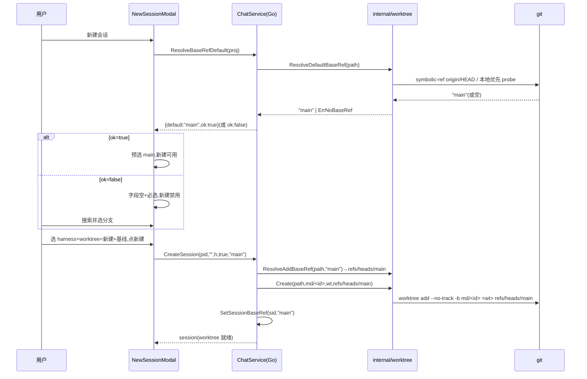
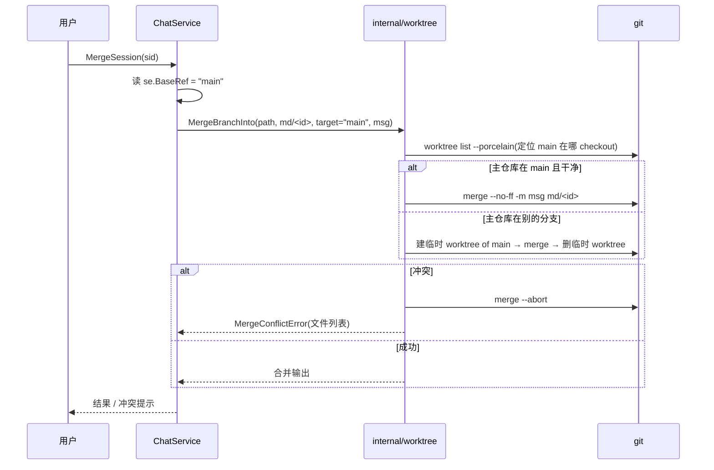

# TODO:worktree 基线分支选择(显式基线,不回退 HEAD)

> 状态:**设计已完成,待开工**。本文是设计契约(AGENTS.md §6.1 文档先于代码)。
> 创建:2026-07-26。开工前先把 §9 的待定项拍板。

---

## 1. 问题

新建 session 的 worktree 基线完全不受控:

- `internal/worktree/worktree.go:94` 的 `Create(repoPath, branch, targetPath, baseRef)` 已有 `baseRef` 入参,但 `internal/chat/chat.go:555` 调用处永远传 `""`。
- `baseRef` 空 → `worktree add ... HEAD`(worktree.go:99)→ **永远基于主仓库此刻的 HEAD**。
- 即:session 的基线取决于"建 session 时主仓库偶然 checkout 在哪个分支"(master / main / develop / 某 feature 都可能),隐式且不可预测。
- 连带:`MergeSession`(chat.go:620 调 `worktree.MergeBranch`)合到主仓库当前 HEAD,也不受控——"从哪岔出去"和"合回哪"两头都失控。

---

## 2. 路线决策:Route A(strict)

**基线永远显式可控,绝不裸用 HEAD。** 探测到默认就用默认(预选);探测不到或用户要改 → 必须从选择器显式选;**绝不静默回退 HEAD**。

- **双层强制**:前端没选基线 → 禁用「新建」;后端 `baseRef` 空 & 探测不到 → 报错。
- **后端权威,前端透传**:`CreateSession` 在后端 resolve;前端只负责"预选 + 让人改"。后端是真相,前端不擅自决策。
- **SQLite 是真相(§1.5)**:基线存 session 表。**不**镜像到 `git config branch.<b>.base`(那是给"刷新基线"功能用的;我们没该功能,KISS 不做)。

---

## 3. 关键决策:baseRef 存「本地分支名」

merge target 必须是**本地分支**(远程跟踪 ref 只能 fetch 更新,不能本地 merge 进去)。所以:

- **baseRef 存本地分支名**(`main` / `develop` / `feature/x`),不存 `origin/main`。
- 让"从哪 checkout 就合并到哪"字面成立、对称(见 §6 已锁决策)。
- 默认基线探测相应**偏向本地**(顺序与单纯抄参考不同):
  1. `git symbolic-ref refs/remotes/origin/HEAD` → 得默认名(如 `main`)→ 本地 `refs/heads/main` 存在 → 返回 `main`。
  2. 否则按序探测,**本地优先**:`refs/heads/main` → `refs/heads/master` → `refs/remotes/origin/main` → `refs/remotes/origin/master`,第一个 `rev-parse --verify` 存在的返回短名。
  3. 全空 → `ErrNoBaseRef`(**不回退 HEAD**)。
- 选择器主要列本地分支;远程跟踪 ref 可选展示(高级场景"基于同事远程分支续做"),选了则记录其本地对应名(本地不存在→报错或要求先建)。

---

## 4. 解析流水线(`internal/worktree/` 新增 3 原语)

全部复用现有 `git()` / `gitRaw()` helper,与现有 `BranchExists`(worktree.go:352)同风格。

### 4.1 `ResolveDefaultBaseRef(repoPath) (string, error)`
如 §3:origin/HEAD symbolic-ref(验证)→ 本地优先 probe list → `ErrNoBaseRef`。v1 写死 `origin`(绝大多数项目;fork/多 remote 让用户手选,文档标注限制)。

### 4.2 `ResolveAddBaseRef(repoPath, baseRef) (string, error)`
命名空间消歧,避免 `git worktree add` 把短名解析成同名 tag:
- `baseRef` 以 `refs/` 开头 → 原样用。
- 含 `/`(如 `origin/main`)→ 先试 `refs/remotes/<base>`,再 `refs/heads/<base>`。
- 纯名(如 `main`)→ 只试 `refs/heads/<base>`。
- 每个 `rev-parse --verify --quiet <ref>^{commit}` 验证;都不在 → 回退原串。

### 4.3 `ListBranches(repoPath) ([]BranchInfo, error)`
`git for-each-ref refs/heads/ refs/remotes/`,排除 `*/HEAD` 伪 ref,按 committerdate 倒序,封顶 ~200。返回 `{Name, Kind(local/remote), Date}`,供选择器搜索。

> `worktree.Create` 本身**不用改**(已有 baseRef 入参)。仅调用方传真值;顺手加 `--no-track`(避免首次 push 前 `git status` 误报 "behind by N")。

---

## 5. CreateSession 改造(chat.go:526)

新签名:`CreateSession(projectID, title, harnessID, useWorktree, baseRef)`。

```
useWorktree && IsRepo:
  if baseRef == "":
      baseRef, err = ResolveDefaultBaseRef(proj.Path)
      if err != nil → return errBaseRefRequired          // 强制
  effective := ResolveAddBaseRef(proj.Path, baseRef)     // 消歧
  worktree.Create(proj.Path, branch, wtPath, effective)  // --no-track
  SetSessionBaseRef(sid, effective)                      // 落 SQLite
```

- 签名变 → **必须 `wails3 gen bindings`**(AGENTS.md §0.5),否则前端用旧签名。

---

## 6. Merge 子系统(决策已锁:合回创建基线)

**原则:merge target = 该 session 的 `BaseRef`。从哪 checkout 就合回哪,毋庸置疑。**

### 6.1 现状
`MergeBranch(repoPath, branch, message)`(worktree.go:136)合到 repoPath 当前 HEAD,依赖主仓库恰好 checkout 在目标分支——不受控。

### 6.2 新机制 `MergeBranchInto(repoPath, branch, target, message)`
target = 本地分支(从 `BaseRef` 推导;若 `BaseRef` 是远程跟踪 ref → 取本地对应名,本地不存在 → 报错)。

先确定 target 当前 checkout 在哪(`git worktree list --porcelain` 解析):

| 情况 | 处理 |
|---|---|
| 主仓库(proj.Path)在 target 且工作区干净 | 直接在主仓库 `merge --no-ff -m msg branch`(现有语义) |
| 主仓库在 target 但脏 | 报错"主仓库工作区不干净,先提交/丢弃" |
| 主仓库在别的分支(target 空闲) | 建 target 的**临时 worktree**,在其中 merge 后删除;主仓库不动 |
| target 被另一个 session 的 worktree 占用 | 报错"基线分支正被会话 <Y> 占用" |

- 冲突:保留现有 `merge --abort` + `conflictedFiles` → `MergeConflictError`(worktree.go:140-144),主仓库/临时 worktree 始终干净。
- 保留 `--no-ff -m`(session 标题作 merge commit 信息,见 chat.go:651 `mergeCommitMessage`)。
- `MergeSession`(chat.go:602)改调 `MergeBranchInto(proj.Path, se.Branch, se.BaseRef, msg)`。

---

## 7. 数据模型

| 改动 | 位置 |
|---|---|
| `Session.BaseRef string`(基线分支,空=非 worktree 或旧 session) | `internal/store/store.go:47` Session 结构 |
| `base_ref TEXT NOT NULL DEFAULT ''` | 新 `migrations/0009_session_base_ref.sql` |
| `sessionColumns` / `scanSession` 加 base_ref;新增 `SetSessionBaseRef` | `internal/store/sessions.go` |

- **旧 session**(baseRef 空):migration backfill 空;merge 时 baseRef 空 → 沿用旧行为(合到主仓库 HEAD)+ 一次性迁移提示;新 session 才受控。
- **共享目录 session**(useWorktree=false):无 baseRef;`MergeSession` 本就报错(chat.go:610),不变。

---

## 8. UI 设计(NewSessionModal.tsx 扩展)

基线字段**只在 `isGit && worktree===true`** 出现(共享目录模式无分支概念):

```
┌─ 新建对话 ──────────────────────────────┐
│ Agent       [omp ▾]                      │
│ 工作目录    ○ 共享项目目录               │
│            ● 新建独立分支 (worktree)      │
│ 基线分支    [ main          ▾ ] ⚠ 必选   │
│          ┌──────────────────────────┐   │
│          │ 🔍 搜索分支…             │   │
│          │ ★ main        本地·默认  │   │ ← 探测默认,星标+预选
│          │   origin/main 远程       │   │
│          │   develop     本地        │   │
│          └──────────────────────────┘   │
│          新分支 md/<id> 将基于此分支创建  │
│                  [取消]   [新建]         │
└──────────────────────────────────────────┘
```

- **预选**:开 modal 时前端调 `ResolveBaseRefDefault(projectID)` → `{defaultBaseRef, ok}`。`ok=true` 预选 + 星标,「新建」立即可用(常见情况一键创建,零摩擦);`ok=false` 字段空 + 必选红字,「新建」禁用。
- **可搜索下拉**(combox):轻量 CSS/DOM 自研(§4.6:禁重 canvas、跨平台一致)。一次性 `ListBranches` 拉取 + 前端过滤(本地仓库够用,KISS)。
- **local/remote 徽标**:小 badge 标识;committerdate 排序;排除 `*/HEAD`。
- **必选态**复用现有 `ns-required` 样式(NewSessionModal.tsx:73 已有此范式)。
- **react-tooltip**(§4.5):label 挂"新分支基于此分支创建;合并时默认合回此分支"。
- **data-testid**(§4.2):`ns-base-ref-select`、`ns-base-ref-option-<name>`、`ns-base-ref-default`。
- **Esc 关闭**:modal 层已处理(NewSessionModal.tsx:31)。
- **i18n**(zh/en):新增 `newSession.baseRef*` 若干 key(JSON 校验 trailing comma + tsc)。

**App.tsx 接线**:`createSession`(App.tsx:653)预取默认 + 分支列表塞进 `newSession` 状态;`confirmNewSession(harness, useWorktree, baseRef)`(App.tsx:668)→ `ChatService.CreateSession(pid,"",harness,useWorktree,baseRef)`(App.tsx:674)。

---

## 9. 端到端流程

### 9.1 创建


### 9.2 合并


---

## 10. 边界 / 生命周期

| 情况 | 处理 |
|---|---|
| 主仓库 detached HEAD | 无关——基线从 ref 解析,不从 HEAD |
| 纯本地无 remote | 走 `refs/heads/main`/`master`;都没 → ErrNoBaseRef → 用户选本地分支 |
| 非标准默认名(develop) | origin/HEAD 指向它即识别 |
| 基线分支创建后被删 | merge 时检测 → 报错,不静默合到 HEAD |
| 同名 tag/分支 | `ResolveAddBaseRef` 命名空间优先级化解 |
| 含 `/` 的本地分支(release/2026) | 先查远程无 → 再查本地,正确 |
| 旧 session(baseRef 空) | backfill 空;merge 沿用旧行为 + 提示 |
| 共享目录 session(useWorktree=false) | 无 baseRef;MergeSession 本就报错,不变 |

---

## 11. KISS 取舍

| 做 | 不做(v1) |
|---|---|
| `--no-track`、消歧、探测默认、`session.BaseRef`、modal 选择器、`MergeBranchInto` | `git config branch.<b>.base` 镜像 |
| 后端权威解析 + 前端预选 | 多 remote/fork 自动识别(origin 够用,手选兜底) |
| 一次性拉分支 + 前端过滤 | 服务端 debounced 搜索(本地无需) |
| —— | 项目级 base pin(见 §12 待定) |

---

## 12. 待定(开工前拍板)

1. **`--no-ff` merge commit 保留?**(推荐:是——session 边界 + AI 标题有价值;代价:非 FF 必须有 worktree 承载 merge)
2. **"target 被其他 session 的 worktree 占用" → 拒绝?**(推荐:是,明确提示是哪个会话)
3. **主仓库脏且在 target → 拒绝?**(推荐:是)
4. **项目级 base pin**(`proj.WorktreeBaseRef`):每次预选探测默认 vs 记住"此项目总从 develop 建"。(推荐:先只做"每次预选默认",pin 留作 phase 2)

---

## 13. 改动面(落地时)

- `internal/worktree/worktree.go`:+`ResolveDefaultBaseRef` / `ResolveAddBaseRef` / `ListBranches` / `MergeBranchInto`;`Create` 加 `--no-track`。
- `internal/chat/chat.go`:`CreateSession` 签名 + 逻辑;+`ResolveBaseRefDefault` / `SearchBaseRefs` binding;`MergeSession` 改 target。
- `internal/store/{store,sessions}.go`:+`BaseRef` 字段 / 列 / 方法。
- `migrations/0009_session_base_ref.sql`。
- `frontend/src/components/NewSessionModal.tsx` + `App.tsx`。
- `wails3 gen bindings`(§0.5)。
- i18n zh/en。
- 测试:`worktree_test`(探测/消歧/list/merge-into)、`chat` CreateSession/MergeSession、`NewSessionModal` mount。
- `docs/worklog/` 新条目(§0.3)。
